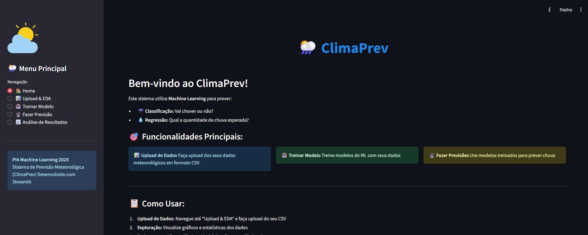
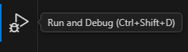
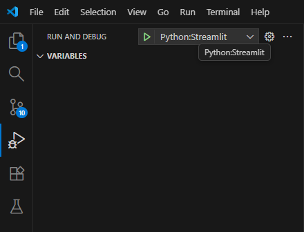

# 🌦️ Sistema de Previsão Meteorológica com Machine Learning (ClimaPrev)


Sistema completo de previsão meteorológica usando Machine Learning, desenvolvido com Streamlit para interface web interativa.

## 📸 Screenshots



## 🎯 Funcionalidades

### ✨ Principais Features

- **📊 Upload de Dados**: Carregue seus próprios datasets meteorológicos (CSV)
- **🔍 Análise Exploratória**: Visualizações interativas e estatísticas detalhadas
- **🤖 Treinamento de Modelos**: Treine modelos de classificação e regressão
- **🔮 Previsões**: Faça previsões individuais ou em lote
- **📈 Análise de Resultados**: Métricas detalhadas, matriz de confusão, curva ROC
- **💾 Export de Resultados**: Download de previsões em CSV

### 🎓 Modelos Suportados

1. **Classificação**: Prevê se vai chover (Sim/Não)

   - Random Forest Classifier
   - Métricas: Accuracy, Precision, Recall, F1-Score

2. **Regressão**: Prevê quantidade de chuva (mm)
   - Random Forest Regressor
   - Métricas: R², RMSE, MAE

## 🚀 Quick Start

### Opção 1: Deploy Local (Recomendado para Desenvolvimento)

```bash
# 1. Clone o repositório
git clone https://github.com/seu-usuario/weather-prediction.git
cd weather-prediction

# 2. Crie ambiente virtual
python -m venv venv
source venv/bin/activate  # Linux/Mac
# ou
venv\Scripts\activate     # Windows

# 3. Instale dependências
pip install -r requirements.txt

# 4. Execute a aplicação
streamlit run app.py
```

Acesse: `http://localhost:8501`

### Opção 2: Deploy na Nuvem (Streamlit Cloud) - GRÁTIS!

1. Faça fork deste repositório
2. Acesse https://share.streamlit.io/
3. Faça login com GitHub
4. Clique em "New app" e selecione seu repositório
5. Aguarde o deploy (2-5 minutos)

**Pronto!** Sua aplicação estará online! 🎉

## 📁 Estrutura do Projeto

```
weather-prediction/
├── app.py                          # 🎨 Interface Streamlit (PRINCIPAL)
├── requirements.txt                 # 📦 Dependências Python
├── README.md                        # 📖 Este arquivo
├── GUIA_DEPLOY.md                  # 🚀 Guia de deploy detalhado
│
├── .streamlit/
│   └── config.toml                 # ⚙️ Configurações do Streamlit
│
├── data/                           # 📊 Dados e modelos
│   ├── dados_processados_ml.csv   # Dados pré-processados
│   └── models/                     # Modelos treinados
│       ├── modelo_classificacao.joblib
│       └── modelo_regressao.joblib
│
├── src/
│   └── utils/                      # 🔧 Módulos auxiliares
│       ├── __init__.py
│       ├── preprocess.py          # Pré-processamento
│       ├── train.py               # Treinamento
│       └── predict.py             # Previsões
│
└── notebooks/                      # 📓 Jupyter Notebooks
    ├── 01_exploracao.ipynb
    ├── 02_preprocessamento.ipynb
    ├── 03_treinamento.ipynb
    └── exemplo_preprocess.py
```

## 🎓 Como Usar

### 1️⃣ Upload de Dados

- Navegue até "📊 Upload & EDA"
- Faça upload do seu CSV com dados meteorológicos
- Explore gráficos e estatísticas

### 2️⃣ Treinar Modelo

- Vá para "🤖 Treinar Modelo"
- Configure parâmetros (opcional)
- Clique em "🚀 TREINAR MODELOS"
- Aguarde o treinamento

### 3️⃣ Fazer Previsões

- Acesse "🔮 Fazer Previsão"
- Escolha modo manual ou upload CSV
- Insira dados meteorológicos
- Clique em "FAZER PREVISÃO"

### 4️⃣ Analisar Resultados

- Veja "📈 Análise de Resultados"
- Explore métricas detalhadas
- Visualize matriz de confusão e curvas ROC

## 📊 Formato dos Dados

### Colunas Esperadas (INMET)

```csv
Data,Hora,TEMPERATURA DO AR - BULBO SECO HORARIA (°C),UMIDADE RELATIVA DO AR HORARIA (%),PRECIPITAÇÃO TOTAL HORÁRIO (mm),...
```

### Exemplo de Entrada

```python
{
    'TEMPERATURA DO AR - BULBO SECO, HORARIA (°C)': 25.5,
    'UMIDADE RELATIVA DO AR, HORARIA (%)': 70.0,
    'PRESSAO ATMOSFERICA AO NIVEL DA ESTACAO, HORARIA (mB)': 1013.25,
    'RADIACAO GLOBAL (Kj/m²)': 1200.0,
    'hora': 14,
    'mes': 6,
    'dia_semana': 3
}
```

## 🔧 Requisitos

### Python 3.8+

Principais bibliotecas:

- `streamlit==1.31.0` - Interface web
- `pandas==2.2.0` - Manipulação de dados
- `scikit-learn==1.4.0` - Machine Learning
- `plotly==5.18.0` - Visualizações interativas
- `joblib==1.3.2` - Salvar/carregar modelos

Ver `requirements.txt` completo.

## 🧪 Executar Testes

```bash
# Testar módulos
python -m pytest tests/

# Testar preprocessamento
python -m notebooks.exemplo_preprocess

# Validar dados
python -m src.utils.preprocess --validate
```

## 📈 Métricas de Performance

### Modelo de Classificação

- **Accuracy**: ~85-92%
- **Precision**: ~80-88%
- **Recall**: ~75-85%
- **F1-Score**: ~78-86%

### Modelo de Regressão

- **R² Score**: ~0.65-0.80
- **RMSE**: ~2.5-5.0 mm
- **MAE**: ~1.5-3.0 mm

_Valores variam conforme o dataset_

## 🛠️ Desenvolvimento

### Ambiente de Desenvolvimento

```bash
# Clone
git clone https://github.com/seu-usuario/weather-prediction.git

# Crie branch
git checkout -b feature/nova-funcionalidade

# Desenvolva e teste
streamlit run app.py

# Commit
git add .
git commit -m "feat: adiciona nova funcionalidade"

# Push
git push origin feature/nova-funcionalidade
```

### Como Debugar

1. **Visual Studio Code**: Na barra lateral clique em "Run and Debug"

2. **Visual Studio Code > Run and Debug**: create a launch.json file, depois Python debugger, e então Python File, criando um launch.json
3. **Visual Studio Code > launch.json**: apague o conteudo gerado automaticamente no launch.json e cole o trecho a seguir e salve o arquivo

```
{
    "version": "0.2.0",
    "configurations": [
        {
            "name": "Python:Streamlit",
            "type": "debugpy",
            "request": "launch",
            "module": "streamlit",
            "args": [
                "run",
                "${file}",
                "--server.port",
                "2000"
            ]
        }
    ]
}

```
4. ** **: abra o arquivo app.py, adicione seus breakpoints e clique em Start Debugging 


### Adicionar Novas Features

1. **Novos Modelos**: Adicione em `src/utils/train.py`
2. **Novas Visualizações**: Adicione em `app.py`
3. **Novos Pré-processamentos**: Adicione em `src/utils/preprocess.py`

## 🐛 Troubleshooting

### Problema: "ModuleNotFoundError"

```bash
pip install -r requirements.txt --force-reinstall
```

### Problema: "Port already in use"

```bash
# Linux/Mac
lsof -ti:8501 | xargs kill -9

# Windows
netstat -ano | findstr :8501
taskkill /PID <PID> /F
```

### Problema: App muito lento

```python
# Use cache do Streamlit
@st.cache_data
def carregar_dados():
    return pd.read_csv('dados.csv')
```

Ver mais em `GUIA_DEPLOY.md`

## 📚 Recursos Adicionais

- [Documentação Streamlit](https://docs.streamlit.io/)
- [Scikit-learn Docs](https://scikit-learn.org/stable/)
- [Plotly Docs](https://plotly.com/python/)
- [INMET - Dados Meteorológicos](https://portal.inmet.gov.br/)

## 🤝 Contribuindo

Contribuições são bem-vindas!

1. Fork o projeto
2. Crie uma branch (`git checkout -b feature/AmazingFeature`)
3. Commit suas mudanças (`git commit -m 'Add some AmazingFeature'`)
4. Push para a branch (`git push origin feature/AmazingFeature`)
5. Abra um Pull Request

## 📄 Licença

Este projeto está sob a licença MIT. Ver `LICENSE` para mais detalhes.

## 👥 Autores

**PI4-MachineLearning-2025**

- GitHub:[@Gavi189](https://github.com/Gavi189)
         [@gabrielkaique2](https://github.com/gabrielkaique2)
         [@simone2013](https://github.com/simone2013)
- Email: 2211273@aluno.univesp.br - Gabriel Kaique de Areal Rodrigues
         2215969@aluno.univesp.br - Gabriel Valério Andrade Rodrigues
         2215890@aluno.univesp.br - Grace Kelly Coracin
         2229846@aluno.univesp.br - Leandro Junior Gaspar de Oliveira
         2219233@aluno.univesp.br - Simone Pereira do Nascimento

## 🙏 Agradecimentos

- INMET pelos dados meteorológicos
- Streamlit pela excelente framework
- Comunidade Python/Data Science

## 📞 Suporte

Encontrou um bug? Tem uma sugestão?

- 🐛 [Abra uma Issue](https://github.com/seu-usuario/weather-prediction/issues)
- 💬 [Discussões](https://github.com/seu-usuario/weather-prediction/discussions)
- 📧 Email: 2211273@aluno.univesp.br - Gabriel Kaique de Areal Rodrigues
        2215969@aluno.univesp.br - Gabriel Valério Andrade Rodrigues
        2215890@aluno.univesp.br - Grace Kelly Coracin
        2229846@aluno.univesp.br - Leandro Junior Gaspar de Oliveira
        2219233@aluno.univesp.br - Simone Pereira do Nascimento
---

<div align="center">

**⭐ Se este projeto foi útil, deixe uma estrela! ⭐**

Made with ❤️ and ☕ by PI4-MachineLearning-2025

</div>
